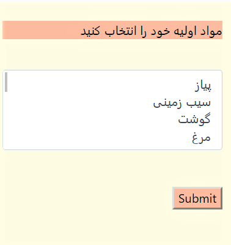
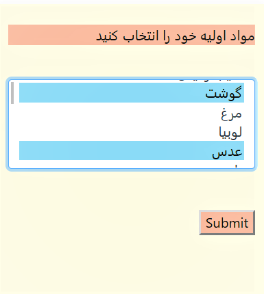
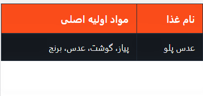

پروژه ی جنگو:
ایده ی پروژه ی من از علاقه شدیدم به شاخه آشپزی نشأت گرفت.
 در این راستا آقای رحیمی - تی ای درس مبانی - بسیار برای ما وقت گذاشتند و واقعا در این مسیر به ما کمک کردند و به ما روند کار و جزییات لازمه را آموزش دادند.
 
این آدرس وب اپ من میباشد که روند کار بدین گونه است که شما مواد غذایی خود را انتخاب میکنید و لیست غذاهایی که با آن مواد میتوانید تهیه کنید، مشاهده میکنید.

<a href="http://98521459.pythonanywhere.com/">my django app</a> 

## Here is the list of ingrediants

---
## Now you can choose some of them

---
## Here is the list of suggested foods

---

